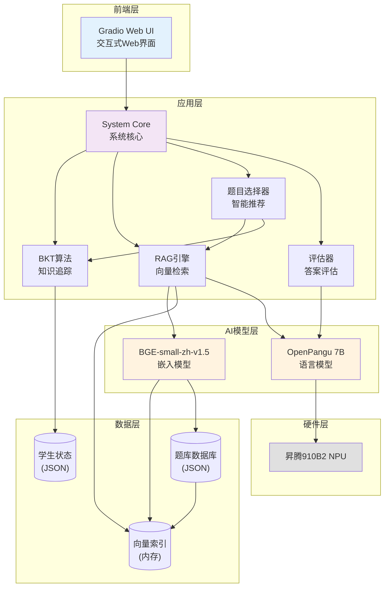
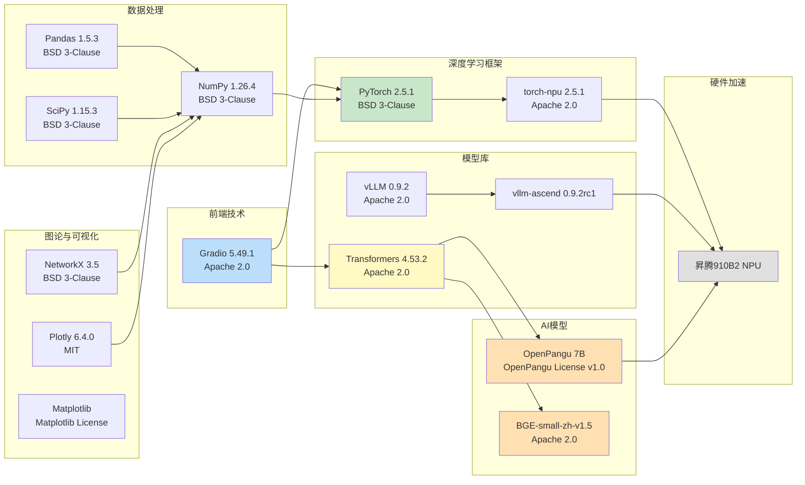
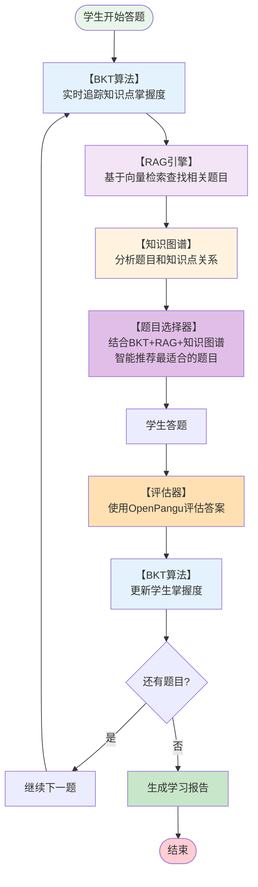

# 🧠 基于LLM和知识图谱协同的个性化出题系统

**Personalized Question Generation System Based on LLM and Knowledge Graph Collaboration**

[](https://git.bookug.cc/star-aisl/PersonalExam)
[](https://www.python.org/)
[](LICENSE)

一个基于LLM和知识图谱协同的个性化出题系统，使用BKT算法、RAG引擎和OpenPangu模型，实现个性化的智能题目生成和推荐。

**开发单位**: 深圳大数据研究院 (SRIBD) | **课题组**: AI系统及应用课题组

**Powered by OpenPangu** - OpenPangu是华为技术有限公司的商标。

**许可证**: 
- **项目代码**: 本项目代码采用 **BUSL 1.1 (Business Source License 1.1)** 许可证，允许非商业使用，商业使用需要授权。
- **OpenPangu模型**: 本项目使用的OpenPangu模型采用 OPENPANGU MODEL LICENSE AGREEMENT VERSION 1.0 许可证，需遵守该许可协议的所有条款。

## 📋 目录

- [功能特性](#-功能特性)
- [技术架构](#-技术架构)
- [系统要求](#-系统要求)
  - [硬件要求](#硬件要求)
  - [软件要求](#软件要求)
  - [部署环境](#部署环境)
- [配置说明](#️-配置说明)
- [使用指南](#-使用指南)
- [项目结构](#-项目结构)
- [开源许可证](#-开源许可证)
- [贡献指南](#-贡献指南)
- [常见问题](#-常见问题)
- [更新日志](#-更新日志)
- [联系方式](#-联系方式)
- [相关资源](#-相关资源)
- [Star History](#-star-history)

## ✨ 功能特性

### 🎯 智能测评
- **自适应题目推荐**: 基于BKT算法和RAG引擎，根据学生掌握度智能推荐题目
- **细粒度知识点追踪**: 支持知识点大类和小类两级精细追踪
- **实时掌握度更新**: 使用贝叶斯知识追踪算法实时更新学生掌握度
- **AI答案评估**: 使用盘古7B模型进行智能答案评估，提供详细反馈

### 📊 学习分析
- **学生画像生成**: 自动生成个性化的学生学习画像
- **薄弱点识别**: 自动识别学生薄弱知识点，提供针对性建议
- **学习模式分析**: 分析答题速度、错误模式、进步趋势等
- **可视化报告**: 生成详细的学习分析报告和可视化图表

### 🕸️ 知识图谱
- **关系网络可视化**: 展示题目、知识点和难度之间的关系网络
- **多种布局算法**: 支持spring、circular、kamada_kawai等布局
- **交互式探索**: 基于Plotly的交互式知识图谱可视化

### ⚙️ 系统管理
- **题库管理**: 支持JSON格式题目导入和管理
- **系统监控**: 实时监控系统状态和资源使用
- **模型管理**: 支持模型重载和缓存清理

## 🏗️ 技术架构

### 核心技术栈



### 主要技术栈



### 核心算法流程



## 💻 系统要求

### 硬件要求


#### 环境配置（参考）
- **CPU**: Kunpeng-920处理器
- **存储**: 196GB总容量（建议至少100GB可用空间用于模型文件和Docker镜像）
- **NPU**: 昇腾910B2 NPU

### 软件要求

- **操作系统**: Linux (推荐 Ubuntu 22.04.5 LTS，容器内使用 Ubuntu 22.04.5 LTS)
- **Python**: 3.11.12 (容器内版本)
- **Docker**: 18.09.0+ (宿主机版本，推荐使用Docker容器化部署)
- **昇腾CANN**: 23.0.6 (如果使用NPU，需要在宿主机安装，容器内驱动版本 23.0.6)

### 部署环境

#### 创建容器

```bash
docker run -dit --net=host \
  --name docker_person_exam \
  --device /dev/davinci6 \
  --device /dev/davinci_manager \
  --device /dev/devmm_svm \
  --device /dev/hisi_hdc \
  -v /usr/local/dcmi:/usr/local/dcmi \
  -v /usr/local/bin/npu-smi:/usr/local/bin/npu-smi \
  -v /usr/local/Ascend/driver/lib64/:/usr/local/Ascend/driver/lib64/ \
  -v /usr/local/Ascend/driver/version.info:/usr/local/Ascend/driver/version.info \
  -v /etc/ascend_install.info:/etc/ascend_install.info \
  -v /opt/pangu:/opt/pangu \
  -v /home:/home \
  quay.io/ascend/cann:pangu-8.1.rc1-910b-py3.11
```

### 2. 复制代码到容器内部

代码需要先上传到SSH服务器，然后复制到容器内。

#### 步骤1: 上传代码到SSH服务器

使用 `你喜欢的工具` 将代码上传到远程服务器：

#### 步骤2: 复制代码到容器内

在SSH服务器上，将代码复制到容器的 `/app` 目录（标准应用目录）：

```bash
# 复制代码到容器内
docker cp /home/xxx/PersonalExam/. docker_person_exam:/app/ # xxx为你上传的目录
```

**注意**：
- 容器内代码路径: `/app/education/`
- 数据目录: `/app/education/data/`（可通过volume挂载持久化）
- 日志目录: `/app/education/logs/`（可通过volume挂载持久化）

### 3. 下载bge-small-zh-v1.5模型

模型地址：https://huggingface.co/BAAI/bge-small-zh-v1.5

```bash
curl -LsSf https://hf.co/cli/install.sh | bash # Make sure the hf CLI is installed

# 方式1: 直接下载到项目目录（推荐）
# 下载到项目 models 目录，与配置文件中的默认路径一致
hf download BAAI/bge-small-zh-v1.5 --local-dir education/models/bge-small-zh-v1.5

# 方式2: 使用默认位置下载
# 默认下载到: ~/.cache/huggingface/hub/
# 下载后需要配置 BGE_MODEL_PATH 环境变量指向实际路径
hf download BAAI/bge-small-zh-v1.5
```


### 4. 准备题库数据

将题目数据文件放置在 `education/data/` 目录下：

```bash
education/data/question_database_2.json
```

题目JSON格式示例：

```json
[
  {
    "题号": 1,
    "问题": "解方程 x^2 - 5x + 6 = 0",
    "答案": "x = 2 或 x = 3",
    "解析": "使用因式分解法...",
    "难度": 0.3,
    "知识点大类": "代数",
    "知识点小类": "一元二次方程"
  }
]
```

### 5. 启动系统

默认模型路径（通过环境变量配置）：
- 盘古7B模型: 通过 `PANGU_MODEL_PATH` 环境变量配置，默认 `/opt/pangu/openPangu-Embedded-7B-V1.1`
- BGE嵌入模型: 通过 `BGE_MODEL_PATH` 环境变量配置
  - **本地开发环境默认值**: `education/models/bge-small-zh-v1.5`
  - **Docker容器环境默认值**: `/app/education/models/bge-small-zh-v1.5`
  - 如果未设置环境变量，将使用上述默认路径

**启动**（如果需要在容器内手动运行）:

```bash
# 进入运行中的容器
docker exec -it docker_person_exam /bin/bash
cd /app

# 安装依赖（使用国内镜像源，速度更快）
# 由于torch torch-npu torchaudio torchvision vllm vllm-ascend这几个包已经在docker中存在，安装是可能造成版本冲突，故不在requirements.txt中申明
pip install -r requirements.txt -i https://pypi.tuna.tsinghua.edu.cn/simple

# 在容器内启动系统
cd /app/education

# 设置环境变量（根据实际路径调整）
export PANGU_MODEL_PATH=/opt/pangu/openPangu-Embedded-7B-V1.1

python main.py
```


> 服务将会运行在: http://localhost:7860（默认端口）。如果要修改端口，请在 `education/config.py` 中修改 `UI_CONFIG['port']` 的值，或通过环境变量 `GRADIO_SERVER_PORT` 设置。

## ⚙️ 配置说明

### 主要配置项

配置文件: `education/config.py`

```python
# 模型配置
PANGU_MODEL_CONFIG = {
    "max_new_tokens": 32768,
    "temperature": 0.7,
    "top_p": 0.9,
    "device": "npu",
}

# 智能出题配置
SMART_QUESTION_CONFIG = {
    "default_question_count": 10,
    "weak_threshold": 0.4,  # 薄弱点阈值
    "weak_point_focus_ratio": 0.7,  # 薄弱点题目比例
}

# UI配置
UI_CONFIG = {
    "port": 7860,
    "share": False,
    "server_name": "0.0.0.0"
}
```

### 环境变量

可以通过环境变量覆盖配置：

```bash
export PANGU_MODEL_PATH="/path/to/pangu/model"
export BGE_MODEL_PATH="/path/to/bge/model"
```

## 📖 使用指南

> 补充功能介绍，加截图

### 开始智能测评

1. **输入学生ID**: 在"智能测评"标签页输入学生ID（如 `student_001`）
2. **选择题目数量**: 使用滑块选择题目数量（5-20题）
3. **开始测评**: 点击"开始智能测评"按钮
4. **答题**: 系统会根据学生掌握度智能推荐题目，学生答题后获得即时反馈
5. **查看报告**: 测评完成后，系统会生成个性化的评估报告


### 学习分析

1. 切换到"学习分析"标签页
2. 输入学生ID
3. 点击"分析"按钮
4. 查看：
   - 整体掌握度统计
   - 薄弱知识点列表
   - 详细学习档案


### 知识图谱

1. 切换到"知识图谱"标签页
2. 选择布局算法（spring/circular/kamada_kawai）
3. 查看题目、知识点和难度之间的关系网络


### 系统管理

1. **题库管理**: 导入JSON格式的题目文件
2. **系统信息**: 查看系统状态和配置信息
3. **模型管理**: 重新加载模型或清除缓存

## 📁 项目结构

```
PersonalExam/
├── education/                    # 主程序目录
│   ├── main.py                  # 程序入口
│   ├── config.py                # 配置文件
│   ├── system_core.py           # 系统核心
│   ├── data/                    # 数据目录
│   │   ├── question_database_2.json  # 题库
│   │   └── student_states.json  # 学生状态
│   ├── models/                  # 模型模块
│   │   ├── llm_models.py        # 语言模型
│   │   └── embedding_model.py  # 嵌入模型
│   ├── data_management/         # 数据管理
│   │   └── question_db.py      # 题库数据库
│   ├── knowledge_management/    # 知识管理
│   │   └── rag_engine.py       # RAG引擎
│   ├── utils/                   # 工具模块
│   │   ├── bkt_algorithm.py    # BKT算法
│   │   ├── evaluator.py        # 评估器
│   │   └── question_generator.py # 题目生成器
│   ├── visualization/           # 可视化
│   │   └── kg_visualizer.py    # 知识图谱可视化
│   └── ui/                      # UI界面
│       └── main_ui.py           # Gradio界面
├── requirements.txt             # Python依赖
├── NOTICE                      # 开源软件声明
├── OPEN_SOURCE_LICENSES.md     # 许可证文档
├── COMPLIANCE_CHECKLIST.md     # 合规检查清单
└── README.md                   # 本文件
```

## 📄 开源许可证

### 项目代码许可证

**本项目代码采用 BUSL 1.1 (Business Source License 1.1) 许可证**

BUSL 1.1 是一种源代码可见的许可证，允许：
- ✅ **非商业使用**: 个人、教育、研究用途完全免费
- ✅ **查看源代码**: 可以查看、复制、修改源代码
- ✅ **分发**: 可以分发源代码（需保留版权声明）
- ⚠️ **商业使用限制**: 商业使用需要获得授权许可


完整的许可证文本请参阅 [LICENSE](LICENSE) 文件。

### OpenPangu模型许可证

本项目使用了OpenPangu模型（openPanGu-Embedded-7B-V1.1）。OpenPangu是由华为技术有限公司（Huawei Technologies Co., Ltd.）发布的大型语言模型。

**OpenPangu模型采用 OPENPANGU MODEL LICENSE AGREEMENT VERSION 1.0 许可证**

**OpenPangu是华为技术有限公司的商标。**

使用OpenPangu模型时，必须遵守OPENPANGU MODEL LICENSE AGREEMENT VERSION 1.0的所有条款和条件，包括：
- 地理限制：不能在欧盟境内使用
- 归属声明：必须包含OpenPangu的归属声明
- 许可证通知：必须包含许可证副本或链接

有关详细信息，请参阅：
- OpenPangu官方仓库: https://ai.gitcode.com/ascend-tribe/openpangu-embedded-1b-model

### 第三方开源软件

本项目还使用了多个开源软件，我们感谢所有开源贡献者的工作。

### 主要依赖

本项目基于以下优秀的开源项目构建（版本信息基于 requirements.txt）：

- **[Gradio](https://www.gradio.app/)** (5.49.1, Apache 2.0) - 用于构建交互式Web界面
- **[PyTorch](https://pytorch.org/)** (2.5.1, BSD 3-Clause) - 深度学习框架
- **[torch-npu](https://www.hiascend.com/)** (2.5.1.post1, Apache 2.0) - 昇腾NPU支持
- **[Transformers](https://huggingface.co/transformers)** (4.53.2, Apache 2.0) - Hugging Face 模型库
- **[vLLM](https://github.com/vllm-project/vllm)** (0.9.2, Apache 2.0) - 高性能LLM推理引擎
- **[vllm-ascend](https://www.hiascend.com/)** (0.9.2rc1, Apache 2.0) - vLLM昇腾支持
- **[NumPy](https://numpy.org/)** (1.26.4, BSD 3-Clause) - 数值计算库
- **[NetworkX](https://networkx.org/)** (3.5, BSD 3-Clause) - 图论和网络分析
- **[Plotly](https://plotly.com/python/)** (6.4.0, MIT) - 交互式数据可视化
- **[FastAPI](https://fastapi.tiangolo.com/)** (0.117.1, MIT) - 高性能Web API框架
- **[Accelerate](https://github.com/huggingface/accelerate)** (1.10.1, Apache 2.0) - 模型加速库

### 许可证文档

完整的开源软件清单和许可证信息请参考：

- 📋 [OPEN_SOURCE_LICENSES.md](OPEN_SOURCE_LICENSES.md) - 完整的依赖清单和许可证信息
- 📄 [NOTICE](NOTICE) - 开源软件声明文件
- 📦 [requirements.txt](requirements.txt) - Python 依赖清单

### 许可证类型

本项目使用的所有依赖都采用**商业友好**的开源许可证：

- ✅ **Apache 2.0** - 允许商业使用，专利友好
- ✅ **BSD 3-Clause** - 允许商业使用，限制最少
- ✅ **MIT** - 允许商业使用，限制最少

**重要说明**: 
- 本项目代码和第三方依赖采用商业友好的开源许可证
- **OpenPangu模型的使用需遵守OPENPANGU MODEL LICENSE AGREEMENT VERSION 1.0**
- 使用本项目时，请确保理解并遵守OpenPangu模型的许可协议条款

### AI 模型

本项目使用的 AI 模型：

- **OpenPangu模型** (openPanGu-Embedded-7B-V1.1)
  - 来源: 华为技术有限公司 (Huawei Technologies Co., Ltd.)
  - 许可证: **OPENPANGU MODEL LICENSE AGREEMENT VERSION 1.0**
  - 参考: https://ai.gitcode.com/ascend-tribe/openpangu-embedded-1b-model
  - **重要**: 本项目使用OpenPangu模型，需遵守OPENPANGU MODEL LICENSE AGREEMENT VERSION 1.0许可协议

- **BGE-small-zh-v1.5**
  - 来源: 北京智源人工智能研究院 (BAAI)
  - 许可证: Apache 2.0
  - 参考: https://github.com/FlagOpen/FlagEmbedding

### 使用说明

**重要**: 使用本项目时，必须遵守以下许可证要求：

1. **项目代码许可证 (BUSL 1.1)**: 
   - 非商业使用：允许个人、教育、研究用途
   - 商业使用：需要获得授权许可

2. **OpenPangu模型许可证**: 必须遵守OPENPANGU MODEL LICENSE AGREEMENT VERSION 1.0的所有条款
   - 必须包含OpenPangu的归属声明
   - 必须包含许可证通知
   - 遵守OpenPangu商标使用规定
   - 不能在欧盟境内使用

3. **第三方开源软件**: 请遵守所有相关开源软件的许可证条款

详细信息请参考：
- 项目许可证: [LICENSE](LICENSE)
- 完整许可证文档: [OPEN_SOURCE_LICENSES.md](OPEN_SOURCE_LICENSES.md)
- 各项目的官方文档

### 致谢

本项目由**深圳大数据研究院 (SRIBD)** 的**AI系统及应用课题组**开发和维护。

感谢所有开源社区和贡献者，他们的工作使本项目成为可能。

特别感谢：
- **深圳大数据研究院 (SRIBD)** - 为本项目提供支持和资源
- **AI系统及应用课题组** - 项目开发团队
- **华为技术有限公司** - 提供OpenPangu模型
- **北京智源人工智能研究院 (BAAI)** - 提供BGE嵌入模型
- **Hugging Face** - 提供Transformers库和模型平台

### 引用和致谢

**重要声明**：如果您的研究、工作或项目中使用了本项目，请引用并致谢 **深圳大数据研究院 (SRIBD)** 和 **AI系统及应用课题组**。

#### 引用格式

如果您在研究中使用了本项目，请使用以下格式引用：

**中文引用格式**：
```
基于LLM和知识图谱协同的个性化出题系统. 
AI系统及应用课题组, 深圳大数据研究院 (SRIBD), 2025.
https://git.bookug.cc/star-aisl/PersonalExam
```

**英文引用格式**：
```
Personalized Question Generation System Based on LLM and Knowledge Graph Collaboration.
AI System and Application Research Group, Shenzhen Research Institute of Big Data (SRIBD), 2025.
https://git.bookug.cc/star-aisl/PersonalExam
```

**BibTeX格式**：
```bibtex
@software{personalexam2025,
  title = {基于LLM和知识图谱协同的个性化出题系统},
  author = {AI系统及应用课题组},
  organization = {深圳大数据研究院 (SRIBD)},
  year = {2025},
  url = {https://git.bookug.cc/star-aisl/PersonalExam},
  note = {Personalized Question Generation System Based on LLM and Knowledge Graph Collaboration}
}
```

#### 致谢示例

在您的论文、报告或项目中，请包含以下致谢内容：

**中文致谢**：
```
本研究/工作使用了"基于LLM和知识图谱协同的个性化出题系统"。
感谢深圳大数据研究院 (SRIBD) 和 AI系统及应用课题组提供该项目。
```

**英文致谢**：
```
This research/work uses the "Personalized Question Generation System Based on LLM and Knowledge Graph Collaboration".
We thank the Shenzhen Research Institute of Big Data (SRIBD) and the AI System and Application Research Group for providing this project.
```

## 🤝 贡献指南

我们欢迎所有形式的贡献！

### 如何贡献

1. **Fork** 本项目
2. 创建特性分支 (`git checkout -b feature/AmazingFeature`)
3. 提交更改 (`git commit -m 'Add some AmazingFeature'`)
4. 推送到分支 (`git push origin feature/AmazingFeature`)
5. 开启 **Pull Request**

### 代码规范

- 遵循 PEP 8 Python 代码规范
- 添加适当的注释和文档字符串
- 确保代码通过所有测试

### 报告问题

如果发现问题，请在 [Issues](https://git.bookug.cc/star-aisl/PersonalExam/issues) 中报告，包括：
- 问题描述
- 复现步骤
- 预期行为
- 实际行为
- 环境信息

## ❓ 常见问题

### Q: 必须使用Docker吗？

A: 是的，本项目使用Docker容器化部署。Docker提供了更好的环境隔离和依赖管理，无需手动配置Python虚拟环境。


### Q: 如何添加新的题目？

A: 可以通过"系统管理"标签页导入JSON格式的题目文件，或者直接编辑挂载的 `education/data/question_database_2.json` 文件。

### Q: 支持哪些知识点？

A: 系统支持自定义知识点结构。在 `education/config.py` 中的 `KNOWLEDGE_HIERARCHY` 配置知识点层级。可以通过volume挂载配置文件来修改。

### Q: 如何修改模型路径？

A: 有三种方式：
1. 在Dockerfile中配置（构建时）
2. 通过环境变量配置（运行时）
3. 挂载配置文件（运行时）

### Q: 系统支持多用户吗？

A: 是的，系统通过学生ID区分不同用户，每个学生有独立的学习档案和状态。数据存储在挂载的volume中，容器重启后数据不会丢失。

### Q: 如何导出学习报告？

A: 目前报告在Web界面显示。可以复制报告内容或使用浏览器的打印功能保存为PDF。

### Q: 容器启动失败怎么办？

A: 检查以下几点：
1. 查看容器日志：`docker logs personal-exam`（本地）或 `docker logs docker_person_exam`（远程）
2. 确认端口7860未被占用（本地部署）
3. 确认NPU设备正确挂载（如果使用NPU）
4. 确认模型文件路径正确
5. 远程部署时，确认所有volume挂载路径存在且可访问

### Q: 如何进行远程SSH部署？

A: 远程SSH部署步骤：
1. 使用SSH密钥连接到远程服务器：`ssh -i .cursor/your_ssh_key your_username@your_server_ip`
2. 上传代码到服务器的 `/home/your_username/Documents/project/PersonalExam` 目录
3. 创建容器（参考"创建容器"章节）
4. 复制代码到容器内：`docker cp /home/your_username/Documents/project/PersonalExam/. docker_person_exam:/app/`
5. 进入容器：`docker exec -it docker_person_exam /bin/bash`
6. 在容器内运行：`cd /app/education && python main.py`

## 📝 更新日志

### Version 3.1.0 (当前版本)

- ✨ 新增细粒度知识点追踪（支持知识点小类）
- ✨ 新增RAG引擎驱动的智能题目推荐
- ✨ 新增知识图谱可视化功能
- ✨ 新增盘古7B模型支持
- 🐛 修复题目选择策略问题
- 🐛 修复学生状态保存问题
- 📚 完善文档和许可证信息

### Version 3.0.0

- 重构系统架构
- 移除LightRAG依赖，使用本地RAG引擎
- 优化BKT算法实现

### Version 2.0.0

- 添加BKT算法支持
- 添加知识图谱功能

## 📞 联系方式

- **项目维护者**: AI系统及应用课题组@SRIBD

## 📚 相关资源

- [华为昇腾社区](https://www.hiascend.com/)
- [Hugging Face](https://huggingface.co/)
- [BAAI智源](https://www.baai.ac.cn/)
- [Gradio文档](https://www.gradio.app/docs/)

## ⭐ Star History

如果这个项目对您有帮助，请给我们一个 ⭐ Star！

---

**Made with ❤️ by AI系统及应用课题组@SRIBD**

*最后更新: 2025年*


